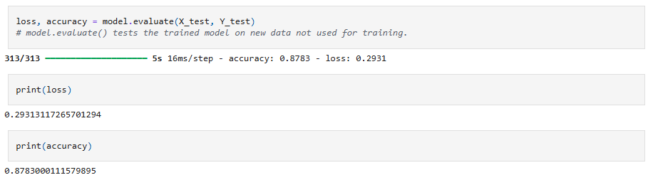

# Review-My-Review 
### (Sentiment Analysis on IMDB Movie Reviews)
This project builds a deep learning model that classifies movie reviews as positive or negative using natural language processing and an LSTM neural network.

## How It's Made
- Technologies Used: `Python, TensorFlow / Keras, NumPy, Pandas, Matplotlib, Scikit-learn`
- This is supervised learning (Classification) as there is a labeled dataset

### Data Preparation
The IMDB dataset provides labeled reviews categorised as either positive or negative. These labels are converted into numerical form for model training:
- Positive → 1
- Negative → 0

The dataset is split into training and testing sets using an 80/20 ratio (which is generally accepted as a good split), with a fixed random seed (42) to ensure reproducibility.
- Why 42? It’s just a convention/inside joke from The Hitchhiker’s Guide to the Galaxy (“the answer to everything is 42”). Could use any number.

The text is prepared using `Keras’ Tokenizer`, which takes the reviews (text) and converts them into sequences of integers (word indexes). This way each review becomes a list of numbers. Fantastic. The problem, however, is that different reviews have different lengths (some are short, some very long ((like my reviews))). Neural networks need fixed-length input so I chose the maximum length to be 200 (tokens). For anyone who wants to try making it more accurate, here's what I learned about changing the max length:
- Larger → more information, but slower training, more memory. 
- Smaller → faster, but risk losing context.

### Building the LSTM Model
The model is sequential which means layers are added one after another in a straight line. The three layers I used are:

1) Embedding Layer
- Instead of treating words as unrelated IDs, the model learns to place similar words close together in vector space.
- Example: `great` and `awesome` → vectors close together. `terrible` → vector far away.

2) LSTM (Long Short-Term Memory) Layer
- LSTM (Long Short-Term Memory) is a special RNN that remembers important info and forgets unimportant info as it reads a sequence word by word.
- dropout=0.2 → 20% of inputs are randomly dropped out (helps prevent overfitting).
- recurrent_dropout=0.2 → 20% dropout on the recurrent connections (the memory links).

3) Dense Output Layer
- A fully connected (dense) layer that takes the 128 features from LSTM and outputs one number.
- The sigmoid squashes this number into the range [0, 1].
- For binary classification (positive/negative sentiment), we want a probability.
- Example: `Output ≈ 0.95` → confident it’s positive. `Output ≈ 0.08` → confident it’s negative.
- Dense(1) → one neuron, because we only predict one thing: **sentiment**.

### Fitting (Training)
The model is trained for five epochs with a batch size of 64.
- An epoch = 1 full pass through the entire training dataset.
- Each batch = 64 reviews. Instead of updating the weights after each individual review, the model processes a batch, computes the average loss, and updates the weights once based on that summary.
- Compile = defines the training configuration, such as the optimizer, loss function, and evaluation metrics.
- Fit = runs the actual training process, feeding data through the model and adjusting the weights to improve its predictions.

### Building a Predictive System
- The system takes a single review (string) as input and using the tokenizer we saved, converts each word into its integer ID. Wrapping the review string in a list makes it compatible with the tokenizer (it expects a list of texts). Neural networks expect fixed-length inputs, so we pad (truncate) sequences. 
- Then it feeds the padded review into the trained LSTM model and returns a probability between 0 and 1 (positive or negative) because the last layer is sigmoid. 
- This function can be used to evaluate individual reviews outside the training dataset. Go ahead and write a review and see how the model performs.

### Evaluation
After training, the model is evaluated to measure its generalisation performance. Here's this model's accuracy, try beating it (I'm sure you can easily).

### Future Enhancements
- Improving preprocessing and handling edge cases
- Developing a frontend application (e.g., using React) to deploy the model as an interactive website.
- Allow Letterboxd reviews to be easily inputted into the model.

### Credits/Resources
- [IMDB Movie Review Sentiment Analysis Using Deep Learning](https://youtu.be/C5wRAlLuuY0?si=QBO7ywLJcdUpDjrn)

